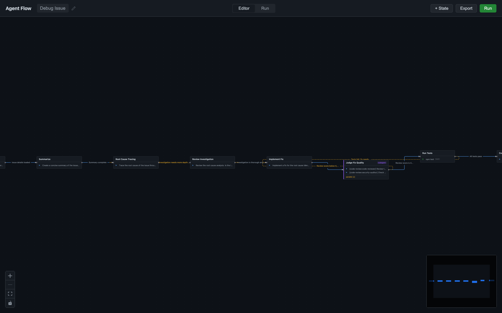
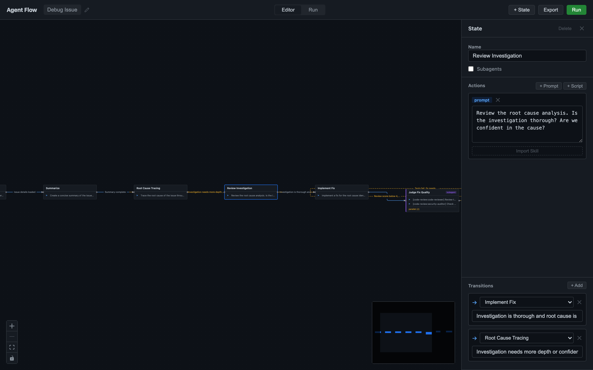
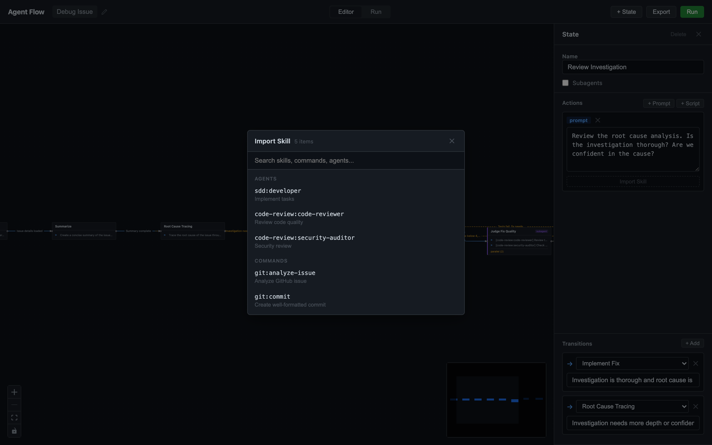
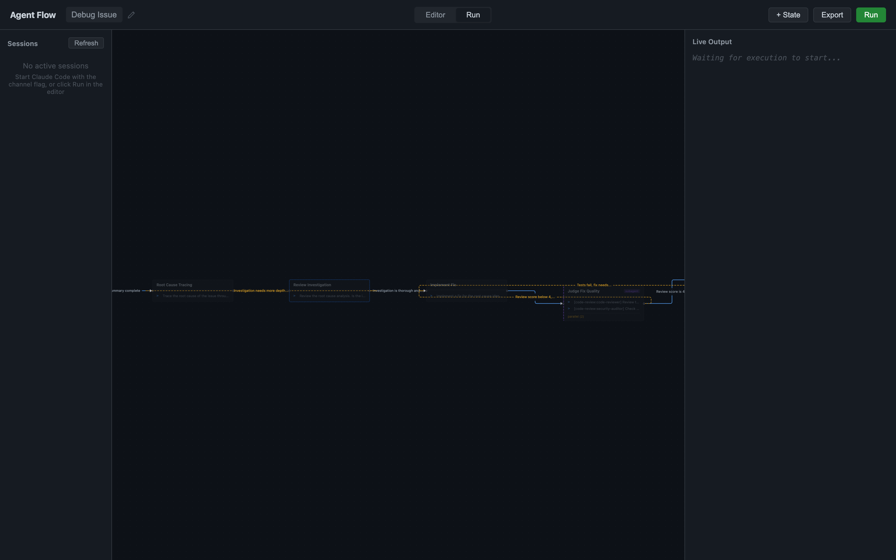

# Agent Flow

A desktop app that turns agent workflows into visual state machines. Build once, run hands-free.



## The Problem

Multi-step agent tasks require constant supervision. Debug an issue? You type "fetch the issue," read the output, type "trace the root cause," evaluate, type "implement a fix," review, type "run tests" — back and forth until done. Agent Flow removes you from the loop. Define the workflow upfront, click Run, review the result.

## How It Works

You compose workflows as state machines in a visual editor. Each state holds actions — prompts or scripts — that Claude Code executes. Transitions between states carry descriptions that Claude reads to decide where to go next. Loops ("review score below 4 → go back to implement") work as regular transitions.

The app communicates with Claude Code through its channel system: an MCP server bridges the desktop UI and a running Claude session. You see each state light up as it executes, read Claude's output in real time, and watch transition decisions appear.

## Quick Start

1. Open Agent Flow
2. Click **+ State** to add states, or load the built-in debug workflow template
3. Draw transitions by dragging between state handles
4. Click a state to edit its actions, set transition descriptions
5. Start Claude Code with the channel: `claude --dangerously-load-development-channels server:agent-flow`
6. Click **Run** in the app

## Building Workflows

### States

A state holds one or more actions. Multiple actions in a single state run in parallel.

- **Prompt actions** send instructions to Claude Code. Click *Import Skill* to pull content from your installed Claude Code skills, commands, or plugin skills.
- **Script actions** run shell commands (bash or python).



Toggle **Subagents** on a state to run each prompt action as a separate Claude Code subagent. Each action gets an agent picker — choose from built-in agents (general-purpose, Explore, Plan) or any agent discovered from your installed plugins.

### Transitions

Transitions connect states. Each carries a description explaining when to take that path: "tests pass," "review score below 4," "root cause identified." After Claude finishes a state, it reads all outgoing transition descriptions and picks the best match. If nothing matches, the app pauses and asks you.

Loop-back transitions (edges pointing earlier in the flow) appear as dashed yellow lines. Forward transitions are solid blue.

### Importing Skills

Each prompt action has an *Import Skill* button. It opens a searchable picker showing everything from:

- `~/.claude/commands/` — your custom commands
- `~/.claude/plugins/cache/` — all installed plugin skills and agents

Selecting a skill appends its content to the action. You can stack multiple skills into one action.



## The Editor

The canvas fills the screen. Click a state to open the side panel with its name, subagent toggle, actions, and transitions. Double-click the workflow name in the top bar to rename it. Click the workflow name to open the library dropdown — switch between saved workflows, create new ones, or delete old ones.

Workflows auto-save to `~/.agent-flow/workflows/`. Node positions persist, so your layout stays where you left it.

## Running Workflows

Switch to the **Run** tab. Three panels:

- **Sessions** (left) — lists active Claude Code sessions connected through the channel
- **Live Flow** (center) — the same canvas, read-only, with states colored by status: faded grey for done, blue glow for active, dashed outline for pending
- **Live Output** (right) — streams Claude's output and shows each transition decision

Controls: **Pause** holds after the current state finishes. **Stop** kills the session.



## Channel Setup

Agent Flow connects to Claude Code through an MCP channel server. Register it in your project's `.mcp.json`:

```json
{
  "mcpServers": {
    "agent-flow": {
      "command": "node",
      "args": ["/path/to/agent-flow/channel-server/dist/index.js"]
    }
  }
}
```

Build the channel server once:

```bash
cd channel-server && npm install && npm run build
```

Then start Claude Code with the channel:

```bash
claude --dangerously-load-development-channels server:agent-flow
```

The channel server picks a random port, writes a session file to `~/.agent-flow/sessions/`, and the app discovers it automatically. Multiple sessions run side by side — each gets its own port.

## Example: Debug Workflow

The built-in template demonstrates a complete debug loop:

```
Fetch Issue → Summarize → Root Cause Tracing → Review Investigation
                                    ↑                    ↓
                                    └──── needs depth ───┘
                                                         ↓ looks good
                              Implement Fix ← score < 4 ← Judge Fix Quality
                                    ↓
                              Run Tests → fail → Implement Fix
                                    ↓ pass
                                  Commit
```

Eight states, ten transitions, two convergence loops. The "Judge Fix Quality" state runs two parallel subagent reviews (code reviewer + security auditor). Claude drives the entire flow, looping until the fix meets quality standards.
